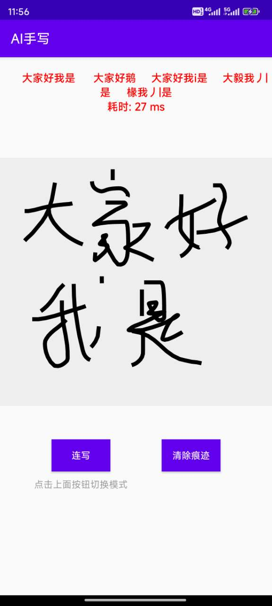
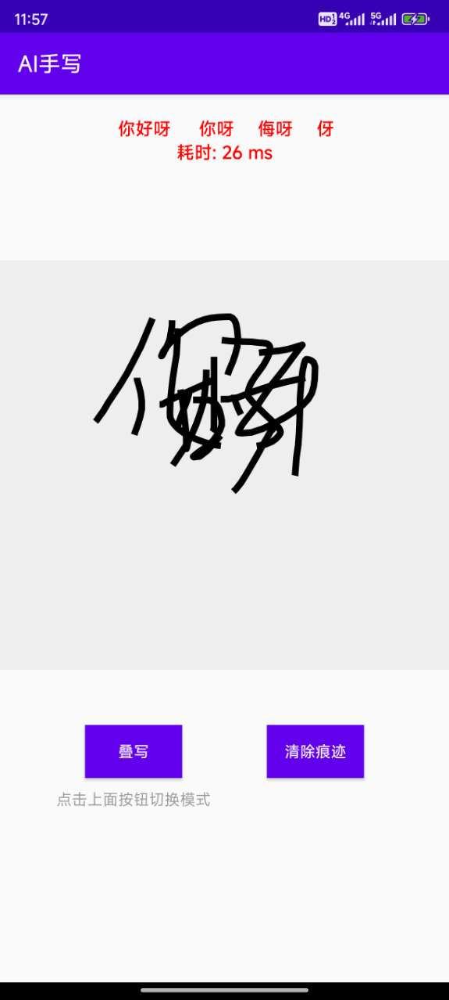
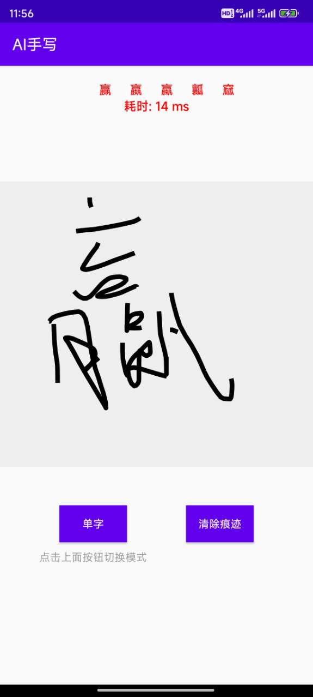

## >>>持续更新维护中>>> [2024年9月16日]
---
## 更新日志

---
2024年05月14日 更新：
1. 基于pytorch深度学习模型开发的手写识别功能，支持叠写、连写、单字模式，识别率99%

---

### Demo 下载 >>> https://github.com/cyfsdk/ai_handwritten_sdk/blob/main/ai_hwr.apk

## 简介

## **演示**

| 连写            | 叠写            | 单字            |
|---------------|---------------|---------------|
|  |  |  |

## 功能

可以提供以下功能：
1，基于pytorch深度学习模型开发的手写识别功能
2，支持叠写、连写、单字模式，识别率99%
3，识别率和识别速度全面超越某文、某云等

## 使用要求

1. 目前只支持android端接入，已在项目实战中大规模使用，可直接商用

## 联系方式

请注明来意，根据以下联系方式获取：
1，QQ：847659598
2，微信号：ai_sdk888
