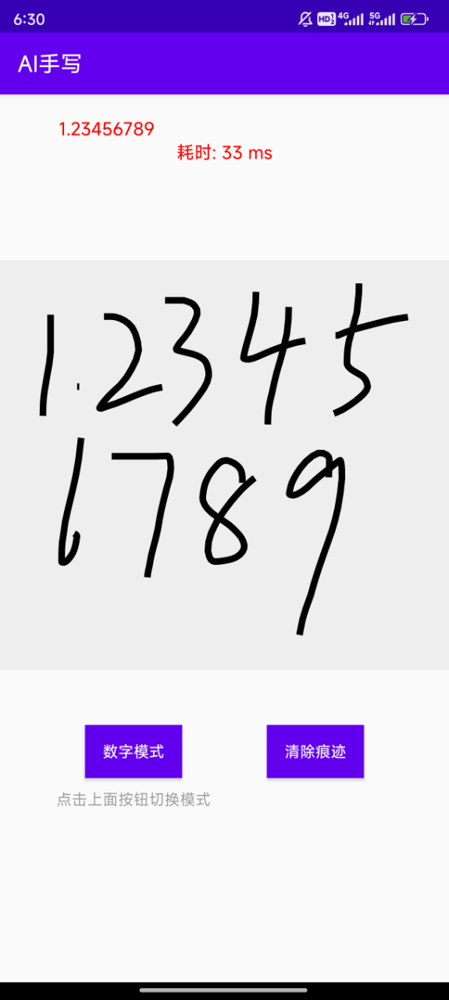

## >>>持续更新维护中>>> [2024年9月24日]
---
## 更新日志

---
2024年09月30日 更新：
1. 字母模式、数字模式等可识别范围可高度定制，如有需要联系本人即可

---
2024年09月24日 更新：
1. 增加数字识别模式

---
2024年09月16日 更新：
1. 基于pytorch深度学习模型开发的手写识别功能，支持叠写、连写、单字、纯数字模式，识别率99%

---

### Demo 下载 >>> https://github.com/cyfsdk/ai_handwritten_sdk/blob/main/ai_hwr.apk

## 简介

## **演示**

| 连写            | 叠写            | 单字            | 数字模式            |
|---------------|---------------|---------------|-----------------|
|  |  |  |  |

## 功能

可以提供以下功能：
1. 基于pytorch深度学习模型开发的手写识别功能
2. 支持叠写、连写、单字、纯数字模式，识别率99%
3. 识别率和识别速度全面超越某文、某云等

## 使用要求

1. 目前只支持android端接入，已在项目实战中大规模使用，可直接商用

## 联系方式

请注明来意，根据以下联系方式获取：
1，QQ：847659598
2，微信号：ai_sdk888
